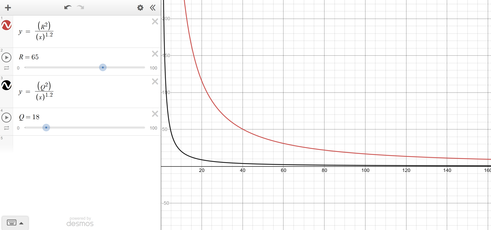
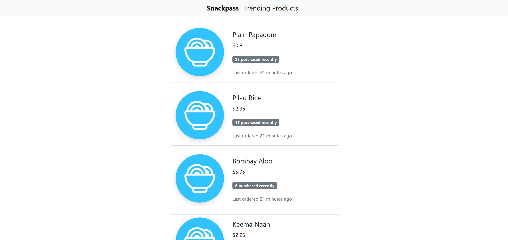

# Snackpass Full Stack Code Challenge
Welcome to the Snackpass Challenge. We really appreciate your time to participate. 

## The Challenge

Assume the customers around a campus order 5000 orders a day from 50 local restaurants. Each order contains one or multiple products. For eg, `2 burritos, a soda, and a side of chips`.

1. Design a full stack application which returns an infinite-scrolling list of trending products to the user.
2. A product can be qualified as trending if it is purchased at least once in last 48 hours
3. Each product should be tagged with two tags:
    * a recent purchase tag: `5 purchased recently`
    * a time tag `ordered 3 min ago`
4. Use a heuristic to determine which trending products gets returned higher. Base heuristic on both recency and number of recent purchases.

## Requirements
1. Implement a Full stack solution including web server, persistent storage and associated code
2. Please submit with in 72 hours from the time you accept invitation. 
3. You can use pseudocode for parts of web application. For instance, you could replace a function body with "assume this service has the following API."

## Practices
### Quality of code 
 Please use best practices for writing code and publish to this repo. 
### Q & A
 Please create an issue and tag @shrimuthu, @aduca98, @nprbst or @seankwalker for questions or review.
### Data
For sample data, use [Sample Orders](https://docs.google.com/spreadsheets/d/1xfAjSlBflehOYj4O7I2YkfcBB1b9VgSHg9X-SmRWmsE/edit#gid=280279953)

Note: Remember to insert your own random timestamps to fit within 48 hours window.
 
## Solution

### Generating Time Stamps
I generated the random timestamps in Python, ensuring orders peaked around noon and 9pm to simulate lunch and dinner time rush. 
I spread the data over 3 days so that some dishes would get filtered out of the Trending Products section if they weren't ordered 
anytime in the past 48 hours.

### MERN Stack
I chose to go with the MERN Stack since it would let me work efficiently and not switch languages.
I debated between SQL and NoSQL. Initially I leaned towards using SQL since it would be more efficient, the query I was running was complex,
and this data is suited for a relational database . Here I chose NoSQL since it let me work faster, but in production I would probably opt 
for a SQL database, and spread this data over multiple tables to make querying efficient.

I use the aggregation command in MongoDB to run the complex query on the database, and defined my own accumulator function to
calculate the number of recent orders.

### Trending Heuristic
I based the trending heuristic on Hacker News's Ranking algorithm, which assigns each post a score based on the formula
```Score = (P-1)/(T+2)^G``` where P is the number of points a post has received, T is the time since submission in hours, and 
G is gravity, which causes the score of a post to drop over time. 

The formula for my trending heuristic is ```Score = (P-1)/(T+2)^G``` where P is the number of points a post has received, 
T is the time since submission in hours, and G is gravity, which causes the score of a post to drop over time. 
I then rank items in descending order of score ```Score = (R^2)/(OT/1000)^G``` where R is the number of recent orders 
(number of orders in the past 2 hours), OT is the time since the most recent order of that product (in milliseconds),
and G is gravity, which causes the trending score of an item to drop over time. 



## Setup and Run

Move to the root directory and execute these commands

### 1. Simulate the data
```
cd mongo && python3 create_data.py && cd ..
```

### 2. Compose the containers
Leave this terminal open to view logs
```
docker-compose -f dev-docker-compose.yml up --build
```

### 3. Setup a records in the database to retrieve (Run this command in a separate terminal)
Only execute this after the previous command has finished setting up the container
```
docker exec snackpass-docker_db_1 mongoimport --type csv -d db -c orders --headerline --drop ordersWithTime.csv
```

### 4. View the applicaton
Visit http://localhost:3000/ to view the trending products on Snackpass!



